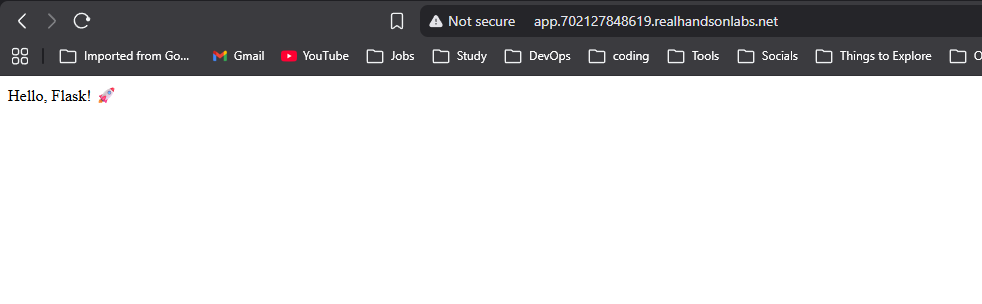

# 🚀 Kubernetes Ingress on AWS EKS

This project demonstrates how to deploy a containerized application on **Amazon EKS** and expose it externally using a **Kubernetes Ingress with NGINX Ingress Controller**.

## 🎯 Objective

The primary goal of this project is to understand and implement:

* How applications are deployed in Kubernetes using **Deployments**
* How internal communication works using **Services**
* How external traffic is routed into the cluster using **Ingress**
* How an **NGINX Ingress Controller** integrates with AWS to provision a LoadBalancer

This simulates a **real-world production scenario** where applications are exposed to users via a centralized routing layer instead of directly exposing services.


## 📌 Architecture Overview

```text
        Internet
            │
            ▼
   AWS LoadBalancer (ELB)
            │
            ▼
   NGINX Ingress Controller
            │
            ▼
        Service (ClusterIP)
            │
            ▼
        Pods (Application)
```

## 🔄 Request Flow Explained

1. User sends request to **LoadBalancer URL**
2. Request reaches **NGINX Ingress Controller**
3. Ingress rules determine routing
4. Traffic is forwarded to **Service**
5. Service routes request to one of the **Pods**
6. Application responds back to user


## 📸 Final Output


## 🧠 Core Concepts

### 🔹 1. Amazon EKS (Elastic Kubernetes Service)

Amazon EKS is a managed Kubernetes service that eliminates the need to control plane management.

* Handles cluster provisioning and scaling
* Integrates with AWS networking (VPC, subnets, security groups)
* Used here as the base infrastructure to run workloads

---

### 🔹 2. Deployment

A **Deployment** defines how your application runs inside the cluster.

* Maintains desired number of pods (replicas)
* Handles rolling updates and rollbacks
* Uses container images (Docker)

👉 In this project:

* A custom Docker image (`swinalwaghmare/ingress-nginx:v1`) is deployed
* Pods are automatically managed and restarted if they fail

---

### 🔹 3. Service (ClusterIP)

A **Service** provides a stable internal endpoint for pods.

* Pods are ephemeral → IPs change
* Service ensures consistent communication inside cluster
* Uses label selectors to route traffic to correct pods

👉 In this project:

* Service type is **ClusterIP**
* Only accessible within the cluster (not from internet)

---

### 🔹 4. Ingress

Ingress is an API object that manages **external HTTP/HTTPS routing**.

* Routes traffic based on host/path rules
* Acts as a single entry point into the cluster
* Requires an Ingress Controller to function

👉 Example:

```
/ → hello-world service
```

---

### 🔹 5. NGINX Ingress Controller

The **Ingress Controller** is the actual component that implements Ingress rules.

* Watches Kubernetes Ingress resources
* Provisions an AWS LoadBalancer
* Routes external traffic to services

👉 In this project:

* NGINX controller is deployed using official manifests
* AWS automatically assigns an **EXTERNAL-IP (LoadBalancer)**


## 📁 Project Structure

```
03-networking/
└── ingress-nginx/
    ├── app/              # Application source + Dockerfile
    ├── manifests/        # Kubernetes YAML files
    │   ├── deployment.yml
    │   ├── service.yml
    │   └── ingress.yml
    └── README.md
```

---

## ⚠️ Common Issues & Debugging

### ❌ Ingress not working

* Ingress Controller not installed or not running
* Check:

  ```bash
  kubectl get pods -n ingress-nginx
  ```

---

### ❌ No EXTERNAL-IP

* AWS LoadBalancer provisioning takes time (2–5 mins)
* Verify:

  ```bash
  kubectl get svc -n ingress-nginx
  ```

---

### ❌ Service not reachable

* Incorrect labels/selectors
* Pods not running
* Debug:

  ```bash
  kubectl describe svc <service-name>
  kubectl logs <pod-name>
  ```

## 🎯 Key Takeaways

* Separation of concerns:

  * Deployment → application lifecycle
  * Service → internal networking
  * Ingress → external routing
* Ingress enables **scalable and flexible routing**
* AWS EKS simplifies Kubernetes management
* NGINX acts as a **reverse proxy + traffic router**


## 👨‍💻 Author

**Swinal Waghmare**

